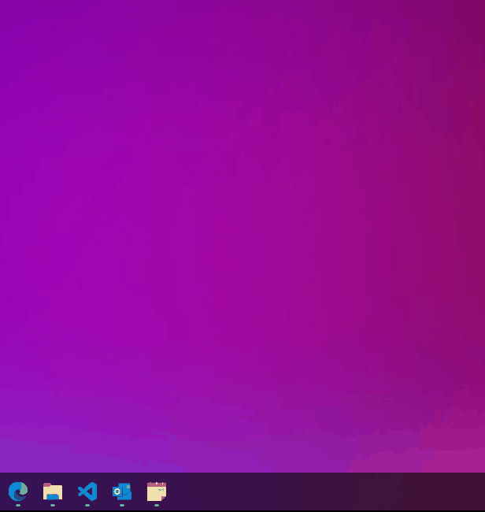
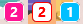
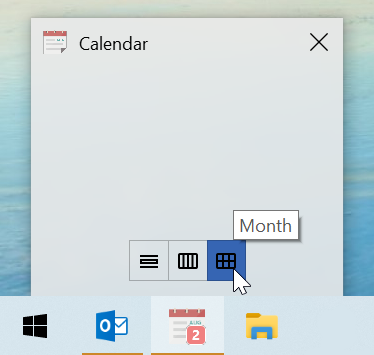

<div align="center">

# Outlook Calendar Shortcut
Outlook Calendar Shortcut is a Windows taskbar application that works as a shortcut to Outlook's calendar view. It notifies you of today's remaining event count by an overlay badge. Clicking the taskbar icon leads you to the calendar view in Outlook.



</div>

## Features
- Notifies today's remaining event count
- Customizable icons and badge colors
- Quick access to the Day, Week and Month views with Thumb buttons

## Requirements
- Tested on Windows 10 and Powershell 5.1
- Outlook desktop app needs to be installed

## Installation
1. Download and extract the zip or clone this repository anywhere you like
1. Copy and edit `settings.ps1` (See [Settings](#Settings))
1. Run [`tools/create_shortcut.bat`](#toolscreate_shortcutbat) and save the shortcut
1. Run the shortcut

# Settings
You can customize the behavior by a settings file. A sample settings file is placed at [sample/settings.ps1](./sample/settings.ps1).

## Outlook settings

```powershell
outlook = @{
    folderPath = "\\your-email-address@sample.com\calendar-folder-name"
}
```
`folderPath` is a path of the outlook calendar folder which the app monitors. You can list all of your calendar folder paths by running [`tools/list_outlook_calendar_folders.bat`](#toolslist_outlook_calendar_foldersbat).

## Icon image

```powershell
iconPath = ".\icon.png"
```
An icon file used for the title bar. The image is converted to `.ico` file during the shortcut creation and also used as a shortcut icon. `.bmp`, `.png`, `.tif`, `.gif` and `.jpg` with single resolution are supported.

## Overlay icon


``` powershell
overlayIcon = @{
    enable = $true

    backgroundColor = "DeepPink"
    textColor = "White"
}
```

You can turn on/off the overlay badge feature by setting `enable` to `$true`/`$false`. You can also change the badge color. Available WPF color names are listed here:
https://docs.microsoft.com/en-us/dotnet/api/system.windows.media.colors?view=net-5.0

## Today's items summary

``` powershell
todaysRemainingItemsSummary = @{
    enable = $true
    maxItemCount = 6
    maxItemCharacterCount = 32
}
```

The summary of today's remaining events is displayed on top of the thumbnail window.

## Click action

``` powershell
clickAction = "FocusOnCalendar"
```

When the taskbar icon is clicked, the action you specify here is executed. The following actions are available:

|Action Name|Description|
|---|---|
|FocusOnCalendar|Opens the calendar view in Outlook keeping the previous view mode.|
|FocusOnToday|Opens the calendar view in Outlook and sets the view mode to Day.|
|FocusOnThisWeek|Opens the calendar view in Outlook and sets the view mode to Week.|
|FocusOnThisMonth|Opens the calendar view in Outlook and sets the view mode to Month.|
|CreateNewAppointment|Opens a dialog to create a new appointment.|

## Thumb buttons



``` powershell
thumbButtons = @(
    ,@{
            description = "Month"
            iconPath = "..\icons\month.png"
            clickAction = "FocusOnThisMonth"
    }
)
```
You can add maximum 7 thumb buttons and assign actions performed when they are clicked. The formats of `iconPath` and `clickAction` are the same as the ones in the global settings.

# Tools

## [tools/list_outlook_calendar_folders.bat](./tools/list_outlook_calendar_folders.bat)

Lists all the Outlook calendar folder paths which the app can monitor. Copy one of the folder paths and paste it in your settings file.

## [tools/create_shortcut.bat](./tools/create_shortcut.bat)

This tool takes a settings file and creates a shortcut to run the app. If you want to create another app which monitors another Outlook calendar, you just need to create a settings file and run this tool again.

## [tools/convert_image_to_ico.bat](./tools/convert_image_to_ico.bat)

Converts an image to `.ico` file. When you want to update the icon of the shortcut, run this tool.

# Sample Icons

The icons except [icon.png](./icons/icon.png) were downloaded from [Google Material Icons](https://fonts.google.com/icons) which are distributed under [Apache License, Version 2.0](https://www.apache.org/licenses/LICENSE-2.0.html).
